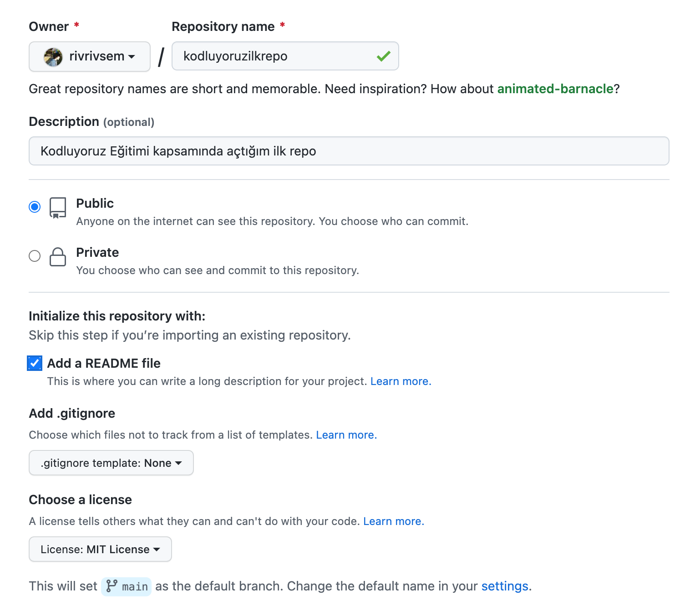

# Kodluyoruz İlk Repo
Bu repo [Kodluyoruz](www.kodluyoruz.org) Git eğitiminde oluşturduğum ilk repo içerisinde bir adet README dosyası, bir adet de index.html barındırıyor

# Installation
Öncelikle projeyi clonlayın
```
git clone [https://github.com/rivrivsem/kodluyoruzilkrepo.git]
```
# Usage
Projeyi klonladıktan sonra VSC programında açınız.
Linux için;
```
cd kodluyoruzilkrepo
code .
```
# Contributing
Pull requestler kabul edilir. Büyük değişiklikler için, lütfen önce neyi değiştirmek istediğinizi tartışmak için bir konu açınız.
# License
[MIT](https://choosealicense.com/licenses/mit/)
## Ornek Resim

